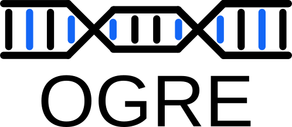

 <br>
*OGRE* - *O*verlapping annotated *G*enomic *RE*gions <br>
Calculate, visualize and analyse overlap between genomic regions


The OGRE package calculates overlap between user defined genomic region datasets. 
Any regions can be supplied i.e. genes, SNPs, or reads from sequencing experiments. 
Key numbers help analyse the extend of overlaps which can also be visualized at a genomic level.
 

## Installation via GitHub
For installing OGRE by GitHub use the install_github() function.

```{bash
if(!requireNamespace("remotes", quietly = TRUE)){
    install.packages("remotes")
}
remotes::install_github("svenbioinf/OGRE")

```

OGRE depends on the following packages:<br>

- GenomicRanges<br>
- S4Vectors<br>
- methods<br>
- data.table<br>
- assertthat<br>
- ggplot2<br>
- IRanges<br>
- Gviz<br>

those can be installed with:
```{r}
if (!requireNamespace("BiocManager", quietly = TRUE))
  install.packages("BiocManager")
BiocManager::install(c(
"GenomicRanges",
"S4Vectors",
"methods",
"data.table",
"assertthat",
"ggplot2",
"IRanges",
"Gviz"))
```    

The OGRE package itself can then be loaded with the following commands:
```{r}
library(OGRE) # load package
vignette("OGRE") #some information on how to use the package
```

## Installation via Bioconductor

(Once OGRE is available on Bioconductor)

Start R and enter:

```{r}
if (!requireNamespace("BiocManager", quietly = TRUE))
    install.packages("BiocManager")

BiocManager::install("OGRE")
library(OGRE)    # load package
vignette("OGRE") # some information on how to use the package
```


## Contact

This software was developed by Sven Berres svenbioinf(AT)gmail.com
